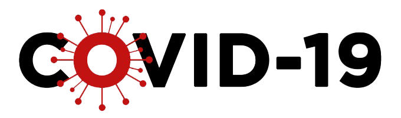

<div id="top"></div>
<!-- PROJECT LOGO -->
<br />
<div align="center">
  <a href="https://github.com/lucasreiste/vue-covid-19">
    
  </a>

  <h3 align="center">COVID-19 Data Tracker</h3>

  <p align="center">
    Informações sobre a situação da COVID-19 em todo o mundo!
    <br />
    <br />
    <a href="https://rainbow-cactus-24d887.netlify.app/">Acessar o site</a>
    ·
    <a href="https://github.com/lucasreiste/vue-covid-19/issues">Comunicar um bug</a>
    ·
    <a href="https://github.com/lucasreiste/vue-covid-19/issues">Pedir novas funcionalidades</a>
  </p>
</div>

<!-- ABOUT THE PROJECT -->
## Sobre o Projeto
[![Product Name Screen Shot][product-screenshot]](https://example.com)

Um olhar para a evolução de casos do novo coronavírus no Brasil e no mundo.

Procurei durante o inicio da pandemia por algum site que disponibilizasse informações detalhadas sobre a COVID-19 no Brasíl e no mundo, mas não encontrei, a maioria apenas apresentavam dados sobre o número de casos e mortes, insuficientes para uma análise um pouco mais profunda.

Por conta disso, criei essa aplicação com intuito de consolidar informações mais detalhadas sobre a situação de cada país, com um design intuitivo para utilização.

Dados disponíveis:

* CASOS DE COVID-19
* MORTES
* TOTAL DE PESSOAS RECUPERADAS
* QUANTIDADE DE NOVOS CASOS POR DIA
* TOTAL DE CASOS A CADA 1M DE HABITANTES
* QUANTIDADE DE TESTES REALIZADOS
* TESTES REALIZ. A CADA 1M DE HABITANTES

<p align="right">(<a href="#top">back to top</a>)</p>


### Desenvolvido com

* [Nuxt.js](https://nextjs.org/)
* [Vue.js](https://vuejs.org/)
* [Chakra UI](https://angular.io/)
* [Axios](https://svelte.dev/)
* [Husky](https://laravel.com) * [ESLint](https://laravel.com)
* [Netlify](https://getbootstrap.com)
* [API Utilizada](https://jquery.com)

<p align="right">(<a href="#top">back to top</a>)</p>


<!-- GETTING STARTED -->
## Getting Started

1. Faça uma copia local do repositório em sua máquina.
2. Execute o comando abaixo para instalar as dependências:
  ```sh
  yarn install
  ```

3.Inicie o projeto com o comando abaixo :D
  ```sh
  yarn dev
```

### Informações sobre a API Utilizada

A API utilizada nesse projeto é a Corona virus World and India data, com limitações em sua versão gratuita.

1. Cadastre-se em [Fast API - Corona Virus](https://example.com) Fast API - Corona Virus
2. Será disponibilizado uma key similar ao formato abaixo:
    ```sh
   37d24df367msh5417f39dsd84dwdwdp171f31jsn761294a9732a
   ```
3. Substitua o campo x-rapidapi-key no arquivo store/actions pela sua nova key.
  ```sh
     this.$axios.setHeader('x-rapidapi-key', 'SUA CHAVE AQUI')
   ```


<!-- MARKDOWN LINKS & IMAGES -->
<!-- https://www.markdownguide.org/basic-syntax/#reference-style-links -->
[contributors-shield]: https://img.shields.io/github/contributors/othneildrew/Best-README-Template.svg?style=for-the-badge
[contributors-url]: https://github.com/othneildrew/Best-README-Template/graphs/contributors
[forks-shield]: https://img.shields.io/github/forks/othneildrew/Best-README-Template.svg?style=for-the-badge
[forks-url]: https://github.com/othneildrew/Best-README-Template/network/members
[stars-shield]: https://img.shields.io/github/stars/othneildrew/Best-README-Template.svg?style=for-the-badge
[stars-url]: https://github.com/othneildrew/Best-README-Template/stargazers
[issues-shield]: https://img.shields.io/github/issues/othneildrew/Best-README-Template.svg?style=for-the-badge
[issues-url]: https://github.com/othneildrew/Best-README-Template/issues
[license-shield]: https://img.shields.io/github/license/othneildrew/Best-README-Template.svg?style=for-the-badge
[license-url]: https://github.com/othneildrew/Best-README-Template/blob/master/LICENSE.txt
[linkedin-shield]: https://img.shields.io/badge/-LinkedIn-black.svg?style=for-the-badge&logo=linkedin&colorB=555
[linkedin-url]: https://linkedin.com/in/othneildrew
[product-screenshot]: images/projeto.png
